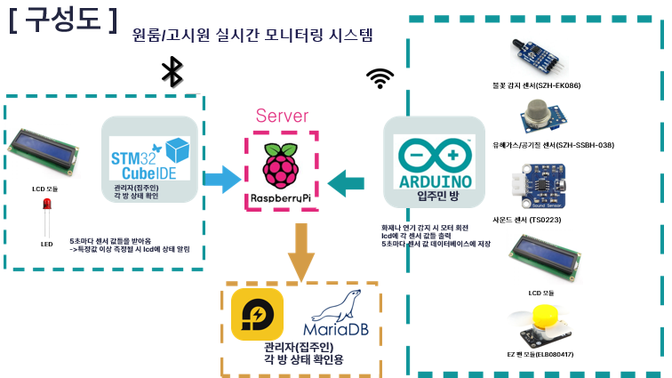
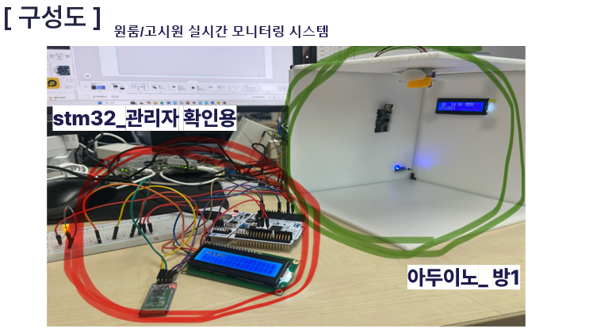

## 💤 Shhh! (쉿!)

원룸·고시원 소음·안전 모니터링 시스템

> **프로젝트 기간:** 2025.11.20 ~ 2025.12.05<br>
> **프로젝트 주제:** “소음과 안전을 동시에 잡는 원룸/고시원 관리 IoT 시스템”

---

## 👥 팀 구성 및 역할

| 이름           | 역할              | 주요 기여                                                                                                                                                                                                       |
| ------------ | --------------- | ----------------------------------------------------------------------------------------------------------------------------------------------------------------------------------------------------------- |
| **김기환 (팀장)** | 시스템 설계 & 펌웨어 개발 | <ul><li>프로젝트 전체 구조 설계 및 통신 프로토콜 기획</li><li>아두이노 기반 **사운드·진동·가스·불꽃 센서 데이터 수집 펌웨어 개발**</li><li>UART·Bluetooth·Wi-Fi 통신 구현 및 아두이노·라즈베리파이 연동</li><li>LCD 출력 및 경고 로직 설계</li><li>GitHub 문서화 및 발표 자료 제작</li></ul> |
| **김동현 (팀원)** | 하드웨어 제작 및 테스트   | <ul><li>센서 및 액추에이터 배선·조립</li><li>LCD·부저·팬 구동 테스트</li><li>Wi-Fi 및 블루투스 통신 모듈 세팅</li><li>시스템 실측 및 성능 검증</li><li>관리자 측 stm32 코딩 및 하드웨어 구성</li></ul>                                                                                             |

---

## 📖 프로젝트 개요

“Shhh(쉿!)” 시스템은<br>
원룸이나 고시원 등 **공유 주거 공간에서 발생하는 소음·진동·화재·가스 문제를 실시간으로 감지**하고,<br>
집주인(관리자)이 원격으로 상태를 모니터링할 수 있도록 설계된 **IoT 기반 환경 감시 시스템**입니다.

---

## 🚨 문제 인식 및 개발 배경

* 원룸 생활 중, **옆방의 전화·음악·진동 등으로 수면 방해**를 받는 일이 잦음<br>
* 직접 항의하거나 신고하기 어려운 환경 → **관리자 중재 의존**<br>
* 불꽃·가스 누출 등의 **안전사고도 초기에 파악 어려움**<br>
* 집주인·관리자 입장에서 **원격 모니터링과 자동 알림 시스템**의 필요성 인식<br>

> 💡 이를 해결하기 위해, “소음을 자동으로 감지하고 경고를 보내는 시스템”을 설계하였습니다.

---

## 🧠 핵심 아이디어

* **Arduino Uno**가 소리·진동·불꽃·가스 데이터를 감지
* 임계치 초과 시: LCD에 경고 + 부저/팬 동작 + Bluetooth로 “조용히 해주세요” 전송
* **Wi-Fi(ESP8266)**를 통해 **라즈베리파이에 실시간 데이터 업로드 및 DB 저장**
* 관리자 웹/앱을 통해 이력 조회 및 원격 제어 가능

---

## 🔧 사용 부품

| 구분   | 부품명                    | 기능                       |
| ---- | ---------------------- | ------------------------ |
| MCU  | STM32F411RE (Nucleo)   | 관리자 모니터링 및 경고 메세지 출력        |
| MCU  | Arduino UNO            | 센서 데이터 수집, LCD·부저·팬 제어, BT/Wi-Fi 통신 |
| 센서   | 사운드 센서 (TS0223/KY-037) | 소음 측정 (ADC)              |
| 센서   | 진동 센서 (SW-420)         | 진동 감지                    |
| 센서   | 불꽃 감지 센서 (YF-S201)     | 화재 감지                    |
| 센서   | 유해가스 센서 (MQ-2)         | 가스 누출 감지                 |
| 모듈   | HC-06                  | Bluetooth (SPP 통신)       |
| 모듈   | ESP8266 (ESP-01)       | Wi-Fi 통신, 서버 업로드         |
| 출력장치 | I2C LCD                | 상태 표시                    |
| 출력장치 | 부저, EZ 팬               | 경고음 및 환기                 |
| 서버   | Raspberry Pi 4         | 데이터베이스 및 시각화 대시보드        |

---

## 🧱 시스템 구성도
<p align="center">
  
  
</p>

---

## 📊 통신 구조

| 구간                     | 방식                | 프로토콜        | 데이터 포맷                                     |
| ---------------------- | ----------------- | ----------- | ------------------------------------------ |
| STM32 ↔ Arduino        | UART (115200 bps) | JSON (줄 단위) | `{"snd":420,"vib":1,"gas":2100,"flame":0}` |
| Arduino ↔ 휴대폰          | Bluetooth (HC-06) | SPP         | `"조용히 해주세요"`                               |
| Arduino ↔ Raspberry Pi | Wi-Fi (ESP8266)   | MQTT / HTTP | JSON 포맷                                    |

---

## 💡 주요 기능

### 1) 센서 데이터 수집 (STM32)

* ADC 기반 사운드·가스 측정
* 디지털 트리거 기반 진동·불꽃 감지
* 100 ms 윈도우로 평균·최댓값 계산
* 1초마다 JSON 데이터 전송

### 2) LCD 표시 및 경고 (Arduino)

* LCD 1행: 센서 값 표시
* LCD 2행: 경고 상태 표시
* 부저/팬 자동 구동

### 3) 원격 모니터링 (Raspberry Pi)

* Wi-Fi로 전송된 데이터를 DB에 기록
* 웹 대시보드로 실시간 조회
* 임계 초과 시 푸시 알림 가능

---

## 🧷 핀맵 요약

| STM32 핀         | 기능      | 연결            |
| --------------- | ------- | ------------- |
| PA0             | ADC     | 사운드 센서 AO     |
| PA1             | ADC     | MQ-2 가스 센서 AO |
| PB5             | GPIO    | 경고 LED        |
| USART2_TX (PA2) | UART TX | Arduino RX    |
| USART2_RX (PA3) | UART RX | Arduino TX    |

| Arduino 핀        | 기능   | 연결      |
| ---------------- | ---- | ------- |
| A4(SDA), A5(SCL) | I2C  | LCD     |
| D3               | PWM  | EZ 팬    |
| D8               | 출력   | 부저      |
| D10/D11          | UART | HC-06   |
| D2/D3            | UART | ESP8266 |

---

## 📖 통신 프로토콜 예시

### 🔹 STM32 → Arduino

```json
{"t":1737609123,"snd_p2p":780,"vib":1,"gas":2100,"flame":0}
```

### 🔹 Arduino → Raspberry Pi (MQTT)

* Topic: `room/101/sensor`

```json
{"snd":780,"vib":1,"gas":2100,"flame":0,"alert":"sound"}
```

---

## ⚙️ 작동 예시 시나리오

| 상황          | 센서 반응            | 결과                           |
| ----------- | ---------------- | ---------------------------- |
| 밤에 옆방 전화 소리 | 사운드 센서 P2P > 700 | LCD 경고 / 부저 ON / BT 알림       |
| 가스 누출 감지    | MQ-2 > 2000      | 팬 ON / Wi-Fi 업로드 “gas_alert” |
| 불꽃 감지       | Flame DO = 1     | 부저 ON + 관리자 푸시               |
| 진동 감지       | SW-420 = 1       | 로그 기록 (DB 저장)                |

---

## 🔧 핵심 기술 요약

* STM32 HAL ADC/USART 기반 데이터 수집
* UART 인터럽트 기반 실시간 통신
* Arduino JSON 파싱 및 LCD 표시
* Bluetooth/ESP8266 이중 무선 전송
* Raspberry Pi 서버의 DB 저장 및 웹 시각화

---

## 🧩 프로젝트 폴더 구조

```
/stm32-fw/
 ├─ Core/Src/main.c
 ├─ Core/Src/my_lcd.c
 ├─ Core/Inc/my_lcd.h
 ├─ ...
/arduino/
 └─ mini_project.ino
/docs/
 └─ 발표자료_쉿!.pptx
```

---

## 📈 향후 개선 방향

* 센서 데이터 필터링(이동 평균/RMS)
* 시간대 별 임계치 자동 조정
* 라즈베리파이 웹 대시보드 고도화
* 다중 방 관리 기능
* 관리자 모바일 푸시 연동

---
